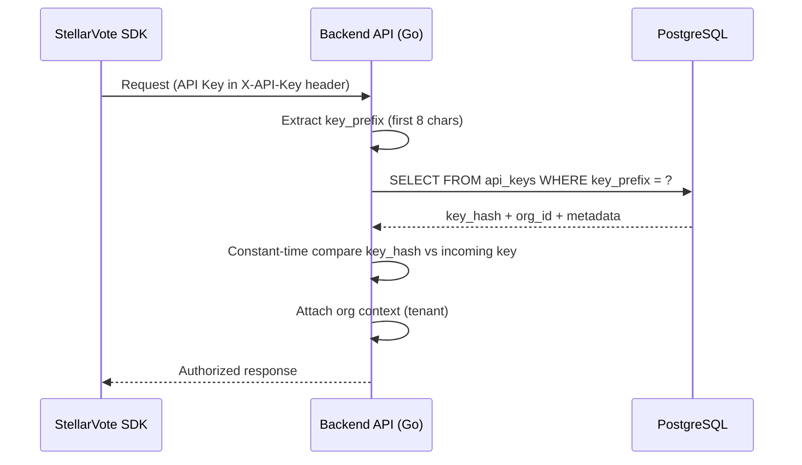

Below are the **authentication + authorization flows** for StellarVote, covering:

* User-level auth (handled by **Authula**)
* API Key auth (app-level identity — StellarVote domain)

---

# 1. Authula-Managed Authentication (User Level)

All user identity flows are delegated to [Authula](https://authula.vercel.app/docs), mounted at `/auth` on the Go backend in library mode.

### Supported Methods

| Method | Authula Endpoint | Notes |
|---|---|---|
| Email + password + OTP | `POST /auth/email-password/sign-up` / `sign-in` | Verification email sent via Email plugin |
| Google OAuth | `GET /auth/oauth2/authorize/google` | Redirects to Google, callback at `/auth/oauth2/callback/google` |
| GitHub OAuth | `GET /auth/oauth2/authorize/github` | Same pattern as Google |
| Stellar wallet | **Post-MVP** | Custom Authula plugin TBD |

### Session Cookie Flow

```
User → Authula sign-in → Authula sets session cookie (authula.session_token)
                              │
                              ├── Browser sends cookie automatically with each request
                              ├── Session extended automatically (update_age = "5m")
                              └── Logout: POST /auth/sign-out clears cookie
```

Authula's default **Session plugin** is used. The cookie is `http_only` (not readable by JS), `secure` (in production), and `same_site = "lax"`. No access/refresh tokens — the session cookie is the sole auth mechanism for the dashboard.

---

# 2. API Key Flow (App Identity — SDK / Server Access)

Machine-to-machine authentication for the StellarVote SDK and server integrations.

### Purpose

Used for:
* Creating elections
* Fetching results
* SDK operations
* Backend integrations

### Flow



### Key Points

* API key maps → `api_keys.org_id` → Authula organization (tenant)
* Keys are stored as **argon2-hashed**; only the prefix is stored in plaintext for lookup
* No human identity involved — this is app-level auth
* API key management endpoints are owned by StellarVote (create, list, revoke)

---

# 3. Auth Decision by Client

| Client | Auth Method | Validation | Tenant Resolution |
|---|---|---|---|
| Dashboard (web UI) | Session cookie (`authula.session_token`) | StellarVote middleware reads cookie, validates via Authula's session service | Org context from session's user → active org membership |
| SDK / automation | API Key (`X-API-Key`) | StellarVote middleware: prefix lookup → constant-time hash compare | Org context from `api_keys.org_id` |

---

# 4. Identity Model

```text id="identity_map_1"
USER LEVEL (Authula)
    └── identifies a human (email, OAuth, or wallet)
    └── Authula tables: users, accounts

ORGANIZATION LEVEL (Authula)
    └── identifies a tenant / StellarVote app
    └── Authula tables: organizations, organization_members

API KEY LEVEL (StellarVote)
    └── identifies a machine / SDK client within a tenant
    └── StellarVote table: api_keys

VOTER LEVEL (Blockchain)
    └── participates in elections (on-chain identity)
    └── wallet address, not stored in auth system
```

---

# 5. Storage Ownership

| Layer | Identity Type | Storage | Managed By |
|---|---|---|---|
| User | Email / OAuth / Wallet | Authula tables | Authula |
| Organization | Organization membership | Authula tables | Authula |
| Roles & Permissions | RBAC assignments | Authula tables | Authula |
| API Key | Machine / SDK tenant | `api_keys` table | StellarVote |
| Voter | Wallet | Blockchain | Stellar (Soroban) |

---

# 6. Stellar Wallet Auth (Post-MVP)

When implemented, this will be a custom Authula plugin that:
1. Requests a nonce from `POST /auth/stellar/nonce`
2. User signs nonce with their Stellar wallet
3. Plugin verifies the ed25519 signature using Stellar's key format
4. On success, links wallet to the Authula user account and returns a JWT

Until then, admin users authenticate via email/password or OAuth.
